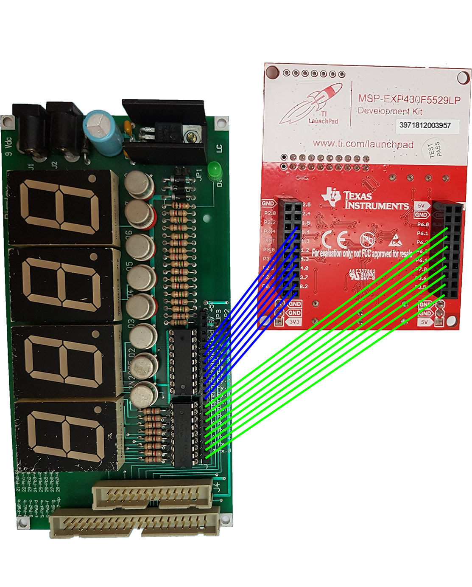

# MSP430 4 x 7_segment_display
This is a library for MSP430F5529 that allows to drive boards with four 7 segments displays.
It includes C functions to handle connection between MSP430 and the board; it also provides means to display strings and integers on four seven segments displays, in many different ways.

## Getting Started
This section provides essential instructions on how to use this library

### Scheme

### Importing
To use this library you have to `#include "display7x4.h"`

### Requirements and Building
The `display7x4.c` library contains no external dependencies, it only requires one of the following compiler to be built successfully:
 - GNU for msp430f5529
 - TI compiler for msp430f5529

These compilers have been tested and they work fine with the functions in the library.

### How to use it
Keep in mind to call the `init()` function before using any function defined in the library.
This function is meant to initialize all the pins needed by the other functions.
After that you can do whatever you want.

##  Running the tests
First of all, you can test if the environment is configurated properly by running the `main.c` program.
You can find all examples on master -> Examples.

### Stopwatch
Run master -> Examples -> Stopwatch -> main.c

### Digital Clock
Run master -> Examples -> Digital_Clock -> main.c
Press button S2 to stop clock's ticking and enter the setting mode.
Press button S1 to increase the value of a digit during the setting.

## Authors

 - Francesco Mecatti - I.T.I.S Enrico Fermi - Italy, Modena

## License
This project is licensed under the MIT license - see the [LICENSE.md](license.md) file for details
